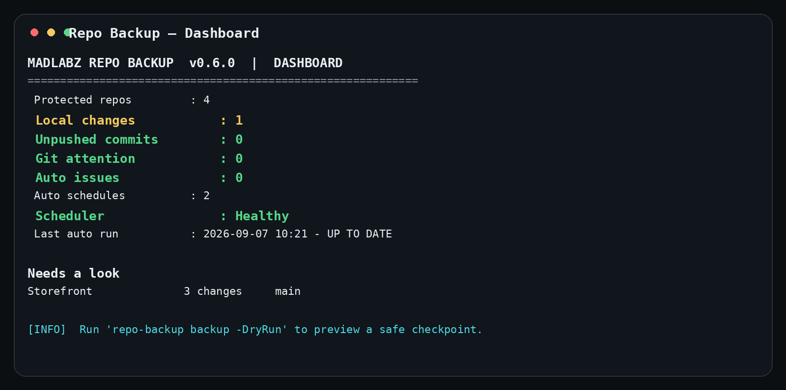
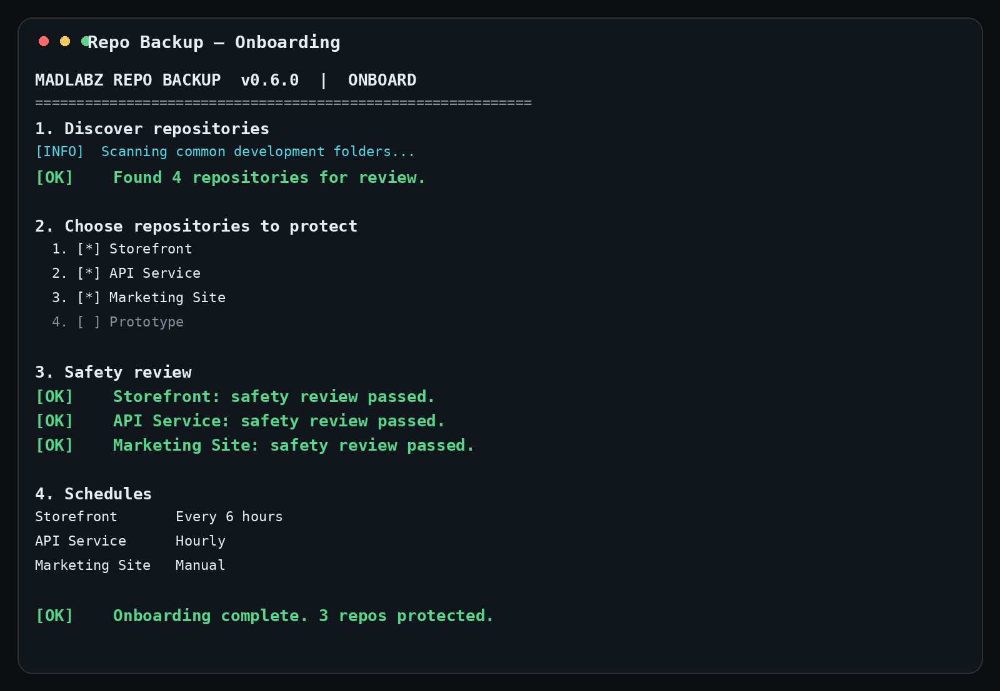
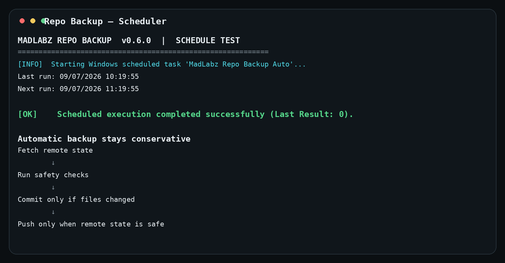

# MadLabz Repo Backup

> **One command. Every repo safely checkpointed.**

MadLabz Repo Backup is a free Windows developer utility for safely checkpointing multiple Git repositories without opening every project one by one.

It discovers repositories, lets you choose which ones to protect, runs Git and secret-safety checks, creates timestamped checkpoint commits when files changed, and pushes only when the remote state is safe.

**Current release: v0.6.2**

## See it in 30 seconds



The guided setup keeps discovery opt-in and runs the same safety engine used by real backups.



Automatic mode can be verified end-to-end from the CLI.



## 60-second quick start

1. Download the latest ZIP.
2. Extract it.
3. Run `VALIDATE-PACKAGE.cmd` and confirm both validation checks pass.
4. Double-click `INSTALL.cmd`.
5. Open a new Git Bash or PowerShell window.
6. Run:

```bash
repo-backup onboard
```

After onboarding, your normal commands are:

```bash
repo-backup
repo-backup backup -DryRun
repo-backup backup
repo-backup schedule
```

Want to see the experience without touching anything?

```bash
repo-backup demo
```

The demo is completely read-only.

### New to Repo Backup?

Read the complete beginner-friendly setup and usage guide:

**[Complete How-to-Use Guide →](docs/HOW-TO-USE.md)**

It walks through download, validation, installation, onboarding, safety checks, Dry Run, your first real backup, automatic scheduling, troubleshooting, updates, and the commands most people actually need.

## What the dashboard tells you

```text
MADLABZ REPO BACKUP  v0.6.2  |  DASHBOARD

Protected repos         : 12
Local changes           : 2
Unpushed commits        : 0
Git attention           : 0
Auto issues             : 0
Auto schedules          : 2
Scheduler               : Healthy
Last auto run           : 2026-09-07 10:21 - UP TO DATE
```

Detailed repository state is always available with:

```bash
repo-backup status
```

## Guided onboarding

```bash
repo-backup onboard
```

Onboarding:

1. scans common development folders
2. shows every repository it knows about
3. keeps newly discovered repos disabled until you explicitly select them
4. handles duplicate technical folder names with friendly aliases
5. reviews Git state, sensitive files, obvious secrets and generated directories
6. preserves existing schedules by default
7. lets you choose Manual / Hourly / Every 6 hours / Daily
8. can run a dry-run through the real backup safety engine
9. installs/refreshes Windows Task Scheduler only when automatic schedules are configured

## Safety is the product

Repo Backup intentionally refuses to be clever with dangerous Git situations.

It **never**:

- auto-pulls
- auto-merges
- rebases
- switches branches for you
- resolves conflicts
- force-pushes

Before a checkpoint it can block on:

- detached HEAD
- merge / rebase / cherry-pick in progress
- remote branch ahead or diverged
- tracked sensitive files such as `.env`
- suspicious changed content that looks like a literal secret
- sensitive filenames present in first-push Git history
- dangerous broad Git roots
- unignored dependency/build output such as `node_modules` or `.next`

Automatic mode uses the same checks as manual mode and waits for an idle window before checkpointing active edits.

See [docs/SAFETY.md](docs/SAFETY.md).

## Automatic backups

Schedules are opt-in per repository:

```text
Manual
Hourly
Every 6 hours
Daily
```

Examples:

```bash
repo-backup schedule "Website" hourly
repo-backup schedule "API" 6h
repo-backup schedule "Prototype" manual
```

Repo Backup installs a single hourly Windows Task Scheduler trigger. The tool itself decides which repositories are actually due.

Clean repos do not create junk commits.

## Installed architecture

Application code:

```text
%LOCALAPPDATA%\MadLabz\RepoBackup\App
```

Persistent data:

```text
%LOCALAPPDATA%\MadLabz\RepoBackup\repos.json
%LOCALAPPDATA%\MadLabz\RepoBackup\history.jsonl
%LOCALAPPDATA%\MadLabz\RepoBackup\auto-runs.jsonl
```

Program updates replace `App`; they do not replace your repository configuration or logs.

## Updates

Check the public release channel:

```bash
repo-backup update check
```

`update check` is read-only.

For v0.6 the actual upgrade remains deliberately explicit:

1. download the newer release ZIP
2. extract it
3. run `UPDATE.cmd`
4. verify:

```bash
repo-backup version
```

This keeps the current running process from trying to overwrite itself.

## Commands

```text
repo-backup
repo-backup onboard
repo-backup demo

repo-backup status
repo-backup backup [repo]
repo-backup backup -DryRun
repo-backup list
repo-backup doctor
repo-backup version

repo-backup schedule
repo-backup schedule <repo> <manual|hourly|6h|daily>
repo-backup schedule test
repo-backup schedule notify <on|off>

repo-backup auto
repo-backup auto log [count]

repo-backup scan [folder]
repo-backup add <path>
repo-backup enable <name|path>
repo-backup disable <name|path>
repo-backup alias <repo> <friendly-name>
repo-backup remove <name|path>

repo-backup update check
repo-backup update
repo-backup help
```

## Platform

- Windows 10/11
- Git
- Windows PowerShell 5.1+
- Git Bash supported
- GitHub is optional; any normal Git remote can be used

## Status

v0.6.2 is the first public-beta release after the core was proven across a real 12-repository working setup, including unattended Windows scheduling, persistent logging, stable installation and guided onboarding.

## MadLabz

Repo Backup is a free MadLabz developer utility.

MadLabz builds focused software and connected intelligence for small businesses and builders.

## Package validation

Before installing or updating a downloaded release, run:

```text
VALIDATE-PACKAGE.cmd
```

It uses the Windows PowerShell parser to validate `repo-backup.ps1` without executing Repo Backup. If parsing fails, do not install that package.

## Windows PowerShell 5.1 source compatibility

The executable `repo-backup.ps1` is intentionally ASCII-only. This avoids legacy Windows PowerShell 5.1 misinterpreting UTF-8-without-BOM source bytes as quotation characters or other syntax.

`VALIDATE-PACKAGE.cmd` now checks both:

```text
ASCII source compatibility: PASS
PowerShell parse: PASS
```

## License

MadLabz Repo Backup is released under the [MIT License](LICENSE).
